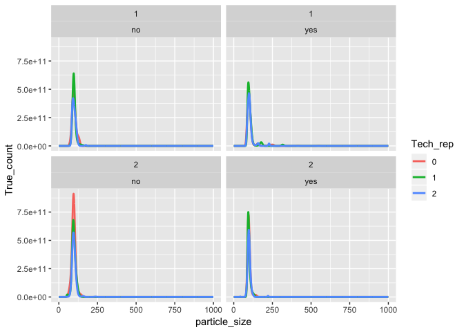

tidyNano 
===========================================================================

tidyNano is an R package that imports raw NanoSight data and provides a framework to clean, analyze, and visualize nanoparticle analysis data.

Overview
========


tidyNano functions (Purple) allow for easily extracting and converting raw NTA count data into a tidy dataframe that is suitable for analysis using dplyr and ggplot2. tidyNano also provides a interactive shiny application (shinySIGHT) for visualizing data.


Installation
============

The latest development version can be installed from github:

``` r
# install.packages("devtools")
devtools::install_github("nguyens7/tidyNano")
#> Downloading GitHub repo nguyens7/tidyNano@master
#> 
#>   
   checking for file ‘/private/var/folders/nw/09s8gt0x6150dzj3432622680000gn/T/RtmpR2Hi4n/remotes17df74f361d3/nguyens7-tidyNano-6f9e462/DESCRIPTION’ ...
  
✔  checking for file ‘/private/var/folders/nw/09s8gt0x6150dzj3432622680000gn/T/RtmpR2Hi4n/remotes17df74f361d3/nguyens7-tidyNano-6f9e462/DESCRIPTION’ (559ms)
#> 
  
─  preparing ‘tidyNano’:
#> 
  
   checking DESCRIPTION meta-information ...
  
─  checking DESCRIPTION meta-information ...It is recommended to use ‘given’ instead of ‘middle’.
#> 
  
    OK
#> 
  
   It is recommended to use ‘given’ instead of ‘middle’.
#> 
  
  
  
─  checking for LF line-endings in source and make files and shell scripts
#> 
  
─  checking for empty or unneeded directories
#> 
  
─  building ‘tidyNano_0.1.1.tar.gz’
#> 
  
   
#> 
```

\# tidyNano Example
-------------------

``` r
library(tidyNano)
library(tidyverse)
#> ── Attaching packages ────────────────────────────────────────────────── tidyverse 1.2.1 ──
#> ✔ ggplot2 3.1.0     ✔ purrr   0.2.5
#> ✔ tibble  1.4.2     ✔ dplyr   0.7.8
#> ✔ tidyr   0.8.2     ✔ stringr 1.3.1
#> ✔ readr   1.3.1     ✔ forcats 0.3.0
#> ── Conflicts ───────────────────────────────────────────────────── tidyverse_conflicts() ──
#> ✖ dplyr::filter() masks stats::filter()
#> ✖ dplyr::lag()    masks stats::lag()

file <- system.file("extdata", "beads.csv", package = "tidyNano")

data <- nanoimport(file)  
#> NTA version: 3.2
#> Sample name:
#> Number of parameters detected: 1
#> Dilution factor detected: 1
#> Auto name = FALSE
#> Custom name: NULL
#> Dilution value: 1 (Didn't parse)

head(data)
#>   particle_size std_10000_yes_2_00 std_10000_yes_2_01 std_10000_yes_2_02
#> 1           0.5                  0                  0                  0
#> 2           1.5                  0                  0                  0
#> 3           2.5                  0                  0                  0
#> 4           3.5                  0                  0                  0
#> 5           4.5                  0                  0                  0
#> 6           5.5                  0                  0                  0
#>   std_10000_no_2_00 std_10000_no_2_01 std_10000_no_2_02 std_10000_yes_1_00
#> 1                 0                 0                 0                  0
#> 2                 0                 0                 0                  0
#> 3                 0                 0                 0                  0
#> 4                 0                 0                 0                  0
#> 5                 0                 0                 0                  0
#> 6                 0                 0                 0                  0
#>   std_10000_yes_1_01 std_10000_yes_1_02 std_10000_no_1_00
#> 1                  0                  0                 0
#> 2                  0                  0                 0
#> 3                  0                  0                 0
#> 4                  0                  0                 0
#> 5                  0                  0                 0
#> 6                  0                  0                 0
#>   std_10000_no_1_01 std_10000_no_1_02
#> 1                 0                 0
#> 2                 0                 0
#> 3                 0                 0
#> 4                 0                 0
#> 5                 0                 0
#> 6                 0                 0
#>   particle_size std_10000_yes_2_00 std_10000_yes_2_01 std_10000_yes_2_02
#> 1           0.5                  0                  0                  0
#> 2           1.5                  0                  0                  0
#> 3           2.5                  0                  0                  0
#> 4           3.5                  0                  0                  0
#> 5           4.5                  0                  0                  0
#> 6           5.5                  0                  0                  0
#>   std_10000_no_2_00 std_10000_no_2_01 std_10000_no_2_02 std_10000_yes_1_00
#> 1                 0                 0                 0                  0
#> 2                 0                 0                 0                  0
#> 3                 0                 0                 0                  0
#> 4                 0                 0                 0                  0
#> 5                 0                 0                 0                  0
#> 6                 0                 0                 0                  0
#>   std_10000_yes_1_01 std_10000_yes_1_02 std_10000_no_1_00
#> 1                  0                  0                 0
#> 2                  0                  0                 0
#> 3                  0                  0                 0
#> 4                  0                  0                 0
#> 5                  0                  0                 0
#> 6                  0                  0                 0
#>   std_10000_no_1_01 std_10000_no_1_02
#> 1                 0                 0
#> 2                 0                 0
#> 3                 0                 0
#> 4                 0                 0
#> 5                 0                 0
#> 6                 0                 0
```

``` r
tidy_data <- data  %>% 
  nanotidy(sep_var = c("Sample", "Dilution","Filter","Injection","Tech_rep"))

head(tidy_data)
#>   particle_size Sample Dilution Filter Injection Tech_rep Count True_count
#> 1           0.5    std    10000    yes         2        0     0          0
#> 2           1.5    std    10000    yes         2        0     0          0
#> 3           2.5    std    10000    yes         2        0     0          0
#> 4           3.5    std    10000    yes         2        0     0          0
#> 5           4.5    std    10000    yes         2        0     0          0
#> 6           5.5    std    10000    yes         2        0     0          0
#>   particle_size Sample Dilution Filter Injection Tech_rep Count True_count
#> 1           0.5    std    10000    yes         2        0     0          0
#> 2           1.5    std    10000    yes         2        0     0          0
#> 3           2.5    std    10000    yes         2        0     0          0
#> 4           3.5    std    10000    yes         2        0     0          0
#> 5           4.5    std    10000    yes         2        0     0          0
#> 6           5.5    std    10000    yes         2        0     0          0
```

``` r
tidy_data %>% 
  ggplot(aes(x = particle_size, y = True_count, color = Tech_rep)) +
  geom_line(size = 1) +
  facet_wrap(Injection ~ Filter)
```



