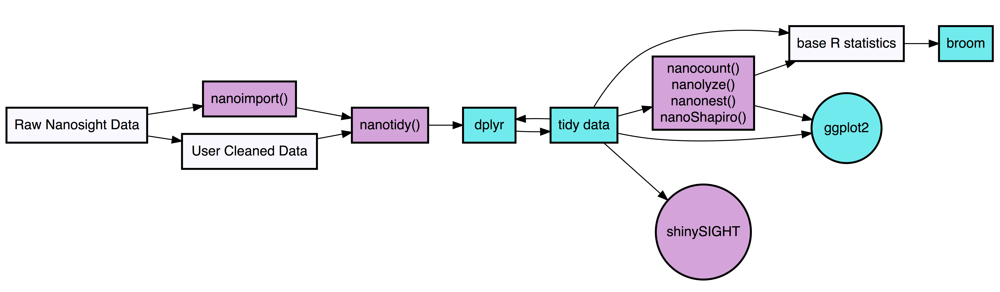
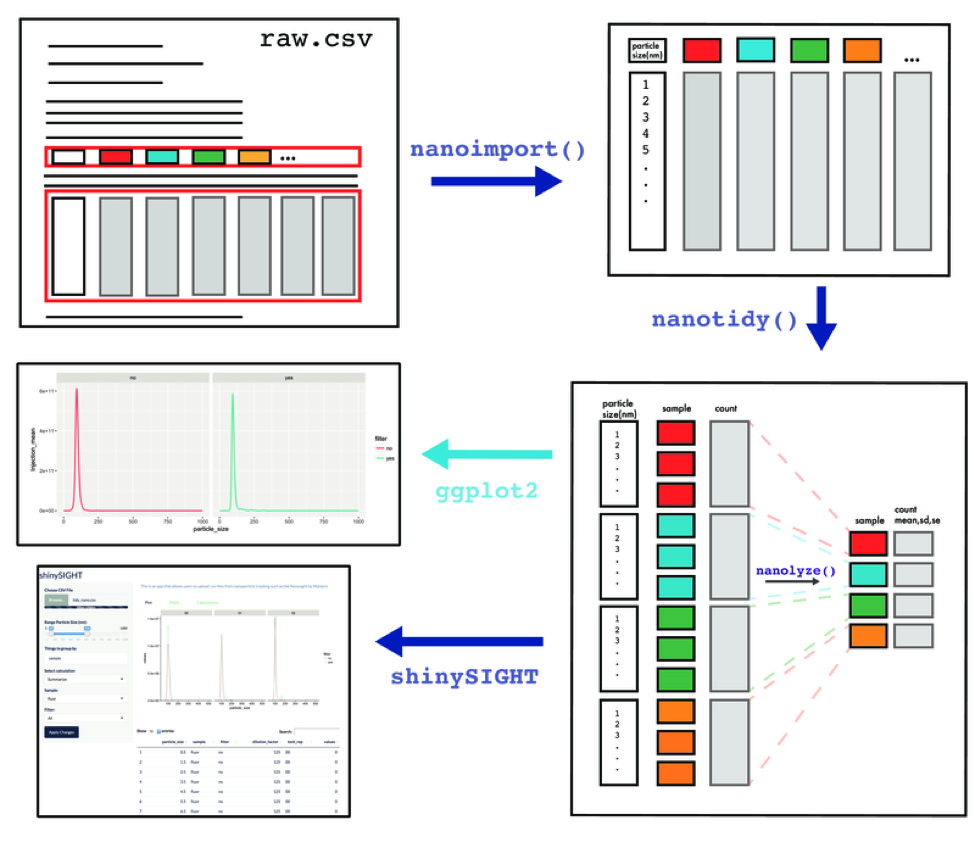

<!-- README.md is generated from README.Rmd. Please edit that file -->

```{r, echo = FALSE}
knitr::opts_chunk$set(
  collapse = TRUE,
  comment = "#>",
  fig.path = "man/figures/"
)
```

# tidyNano 
tidyNano is an R package that imports raw NanoSight data and provides a framework to clean, analyze, and visualize nanoparticle analysis data.  You can browse the source code on [GitHub](https://github.com/nguyens7/tidyNano).


Check out our preprint on [BioRxiv](https://www.biorxiv.org/content/early/2018/12/20/503292)!

# Overview



tidyNano functions (Purple) allow for easily extracting and converting raw NTA count data into a tidy dataframe that is suitable for analysis using dplyr and ggplot2. tidyNano also provides a interactive shiny application (shinySIGHT) for visualizing data.



# Installation

The latest development version can be installed from github:

```{r eval=FALSE, include=FALSE}
# install.packages("devtools")
devtools::install_github("nguyens7/tidyNano")
```

# tidyNano Example
----------------

```{r message=FALSE, warning=FALSE}
library(tidyNano)
library(tidyverse)

file <- system.file("extdata", "beads.csv", package = "tidyNano")

data <- nanoimport(file)  

head(data)
```

```{r}
tidy_data <- data  %>% 
  nanotidy(sep_var = c("Sample", "Dilution","Filter","Injection","Tech_rep"))

head(tidy_data)

```

```{r}
tidy_data %>% 
  ggplot(aes(x = particle_size, y = True_count, color = Tech_rep)) +
  geom_line(size = 1) +
  facet_wrap(Injection ~ Filter)
```

